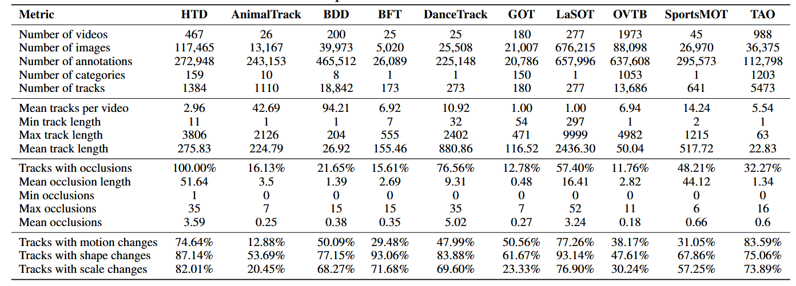

# HardTracksDataset: A Benchmark for Robust Object Tracking under Heavy Occlusion and Challenging Conditions

[ [ArXiv](https://arxiv.org/abs/2406.04221) ]

[Computer Vision Lab, ETH Zurich](https://vision.ee.ethz.ch/)

    

## Introduction [TODO]
The robust association of the same objects across video frames in complex scenes is crucial for many applications, especially Multiple Object Tracking (MOT). Current methods predominantly rely on labeled domain-specific video datasets, which limits the cross-domain generalization of learned similarity embeddings.
We propose MASA, a novel method for robust instance association learning, capable of matching any objects within videos across diverse domains without tracking labels. Leveraging the rich object segmentation from the Segment Anything Model (SAM), MASA learns instance-level correspondence through exhaustive data transformations. We treat the SAM outputs as dense object region proposals and learn to match those regions from a vast image collection.
We further design a universal MASA adapter which can work in tandem with foundational segmentation or detection models and enable them to track any detected objects. Those combinations present strong zero-shot tracking ability in complex domains.
Extensive tests on multiple challenging MOT and MOTS benchmarks indicate that the proposed method, using only unlabeled static images, achieves even better performance than state-of-the-art methods trained with fully annotated in-domain video sequences, in zero-shot association.

## Results of state of the art trackers on HTD
<table>
  <caption>TETA evaluation of state-of-the-art trackers on the HTD validation and test sets, grouped by tracking approach.</caption>
  <thead>
    <tr>
      <th rowspan="2">Method</th>
      <th colspan="4">Validation</th>
      <th colspan="4">Test</th>
    </tr>
    <tr>
      <th>TETA</th>
      <th>LocA</th>
      <th>AssocA</th>
      <th>ClsA</th>
      <th>TETA</th>
      <th>LocA</th>
      <th>AssocA</th>
      <th>ClsA</th>
    </tr>
  </thead>
  <tbody>
    <tr>
      <td colspan="9"><em>Motion-based</em></td>
    </tr>
    <tr>
      <td>ByteTrack</td>
      <td>34.877</td>
      <td>54.624</td>
      <td>19.085</td>
      <td>30.922</td>
      <td>37.875</td>
      <td>56.135</td>
      <td>19.464</td>
      <td>38.025</td>
    </tr>
    <tr>
      <td>DeepSORT</td>
      <td>33.782</td>
      <td>57.350</td>
      <td>15.009</td>
      <td>28.987</td>
      <td>37.099</td>
      <td>58.766</td>
      <td>15.729</td>
      <td>36.803</td>
    </tr>
    <tr>
      <td>OCSORT</td>
      <td>33.012</td>
      <td>57.599</td>
      <td>12.558</td>
      <td>28.880</td>
      <td>35.164</td>
      <td>59.117</td>
      <td>11.549</td>
      <td>34.825</td>
    </tr>
    <tr>
      <td colspan="9"><em>Appearance-based</em></td>
    </tr>
    <tr>
      <td>MASA</td>
      <td>42.246</td>
      <td>60.260</td>
      <td>34.241</td>
      <td>32.237</td>
      <td>43.656</td>
      <td>60.125</td>
      <td>31.454</td>
      <td><strong>39.390</strong></td>
    </tr>
    <tr>
      <td>OV-Track</td>
      <td>29.179</td>
      <td>47.393</td>
      <td>25.758</td>
      <td>14.385</td>
      <td>33.586</td>
      <td>51.310</td>
      <td>26.507</td>
      <td>22.941</td>
    </tr>
    <tr>
      <td colspan="9"><em>Transformer-based</em></td>
    </tr>
    <tr>
      <td>OVTR (TAO classes)</td>
      <td>22.585</td>
      <td>44.031</td>
      <td>23.724</td>
      <td>0.000</td>
      <td>23.771</td>
      <td>46.338</td>
      <td>24.974</td>
      <td>0.000</td>
    </tr>
    <tr>
      <td><strong>Double-MASA (ours)</strong></td>
      <td><strong>42.716</strong></td>
      <td><strong>60.364</strong></td>
      <td><strong>35.252</strong></td>
      <td><strong>32.532</strong></td>
      <td><strong>44.063</strong></td>
      <td><strong>60.319</strong></td>
      <td><strong>32.735</strong></td>
      <td>39.135</td>
    </tr>
  </tbody>
</table>

## Installation
Please refer to [INSTALL.md](docs/INSTALL.md)

## Run Double-Masa on HTD
Please refer to [GETTING_STARTED.md](docs/GETTING_STARTED.md)

### Limitations:
MASA is a universal instance appearance model that can be added atop of any detection and segmentation models to help them track any objects they have detected. However, there are still some limitations:
- MASA does not have the ability to track objects that are not detected by the detector.
- MASA cannot fix inconsistent detections from the detector. If the detector produces inconsistent detections on different video frames, results look flickering.
- MASA trains on pure unlabeled static images and may not work well in some scenarios with heavy occlusions and noisy detections. Directly using ROI Align for the noisy or occluded objects yields suboptimal features for occlusion handling. We are working on improving the tracking performance in such scenarios.

## Contact
For questions, please contact the [Siyuan Li](https://siyuanliii.github.io/).

### Acknowledgments

The authors would like to thank: [Bin Yan](https://masterbin-iiau.github.io/) for helping and discussion;
Our code is built on [mmdetection](https://github.com/open-mmlab/mmdetection), [OVTrack](https://github.com/SysCV/ovtrack), [TETA](https://github.com/SysCV/tet), [yolo-world](https://github.com/AILab-CVC/YOLO-World). If you find our work useful, consider checking out their work.
